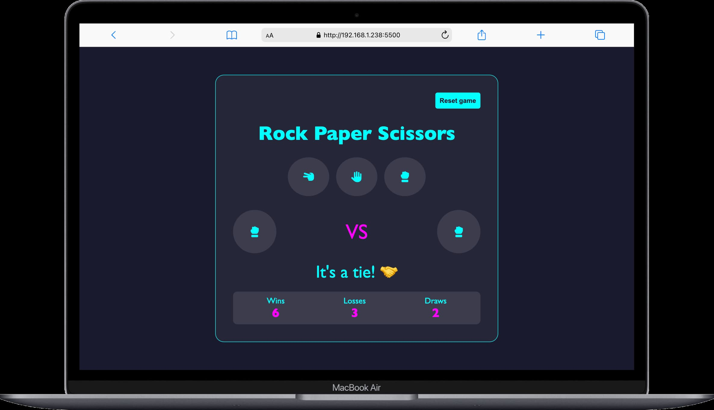

# 🪨📄✂️ משחק אבן נייר ומספריים

משחק קטן וכיפי שבנוי ב־HTML, SCSS ו־JavaScript.  
השחקן בוחר אבן / נייר / מספריים ומתמודד מול המחשב.  
נשמרים נצחונות, הפסדים ותוצאות תיקו.

---

## 🚀 איך לשחק
1. פותחים את הקובץ `index.html` בדפדפן.
2. בוחרים אחת מהאפשרויות: 🪨 אבן, 📄 נייר, ✂️ מספריים.
3. המחשב יבחר אפשרות אקראית, והמשחק יציג מי ניצח.
4. ניתן לאפס את הניקוד בלחיצה על כפתור **איפוס**.

---

## 📸 צילום מסך
(כאן אפשר לשים תמונה שתראה איך זה נראה במשחק)

---

## 🛠️ טכנולוגיות
- **HTML** – מבנה העמוד  
- **SCSS** – עיצוב וסטייל  
- **JavaScript** – לוגיקה ואינטראקטיביות  

---
